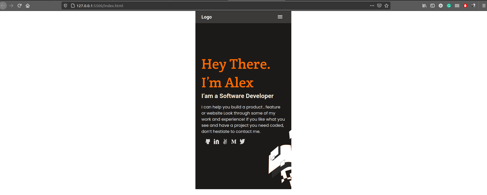
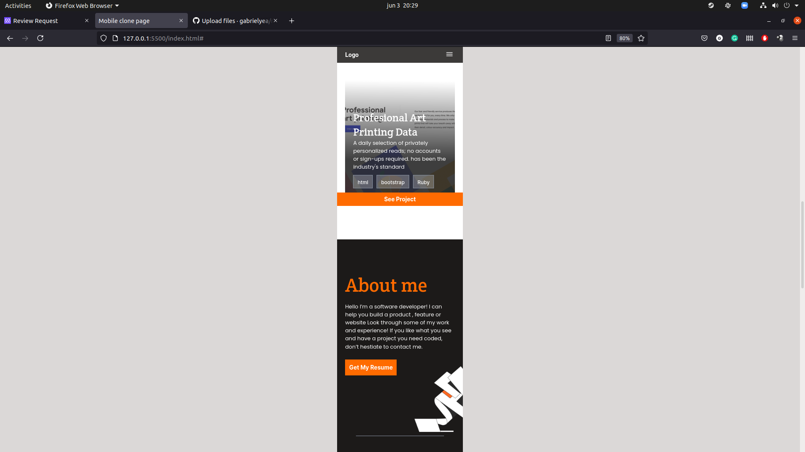

# Portfolio - Mobile skeleton app

> Module 1 portfolio project, skeleton app page with no functionality.
> The mobile page should be a clone of [this template](https://www.figma.com/file/l7SqJ3ZfkAKih9sFxvWSR4/Microverse-Student-Project-1?node-id=48%3A27)

<!--Additional description about the project and its features.-->

## Built With
- css
- html

## Live Demo
[Check it out!](https://gabrielyea.github.io/module1-portfolio-setup/)

<!--## Getting Started

**This is an example of how you may give instructions on setting up your project locally.**
**Modify this file to match your project, remove sections that don't apply. For example: delete the testing section if the currect project doesn't require testing.**

To get a local copy up and running follow these simple example steps.

### Prerequisites

### Setup

### Install

### Usage

### Run tests

### Deployment-->

## Authors

👤 **Gabriel Rendon*

- GitHub: [@gabrielyea](https://github.com/gabrielyea)

## 🤝 Contributing

Contributions, issues, and feature requests are welcome!

<!--Feel free to check the [issues page](../../issues/).-->

## Show your support

Give a ⭐️ if you like this project!

<!--## Acknowledgments-->

## 📝 License

This project is [MIT](./MIT.md) licensed.
